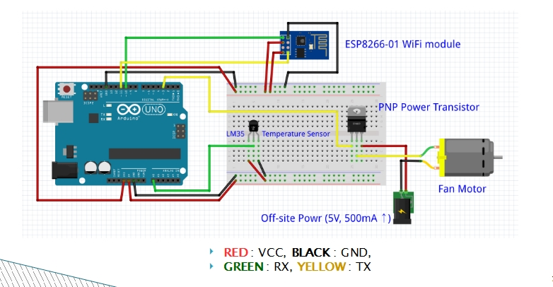

##Overview

*Sleeper Device can vary. They only have to support wifi ap mode message analysing. People who make Sleeper Device should make message analysing file
in android *.java file so that developer can use them to send to their Sleeper Device. Developer can just make both Sleeper Device, Sleeper App using
Sleeper Library. In **sleeper_device_arduino** folder above , **esp8266** folder is where arduino code is placed and Sleeper_Library is where message analyzer
class for arduino is placed.*

##Arudino Circuit

##Note
 - Currently, *Sleeper_Library* will vary depends on message format that Sleeper Device developer has made. This library did not separate device specific code
   and general code. We will fix this later.
   
 - Only arduino is supported at this stage. But we will fix this to support ESP 201 wifi module, which can be directly coded.