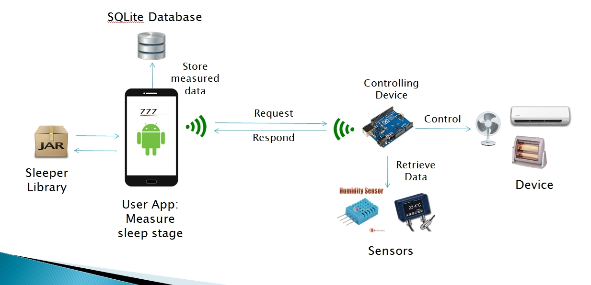

#Sleeper

##Summary

*There are many sleep tracking apps in android market, and wearable gadgets on the market. They track your sleep stage during
your sleep and gives analysis of how you slept well. But that's all. They don't offer you some treatment to improve your
sleep quality. Some users might want app to improve their sleep quality too. So we thought about how to improve users sleep
quality using sleep stage. Then we got to the idea, in which we build an app that not only tracks sleep stage but also control
remote device, like in summer fan, air conditional, or in winter heater, via wifi. The key feature of our project is that we made
library called "Sleeper", which does sleep classification and give classified sleep stage so that developer can only think about 
device controlling mechanism. We also thought that it should be opensource sodeveloper can make and modify our app much better than
now since this is our first android app ever made. So we'd like to get advice to design of classes, other feature to add or even harsh feedback!!*

##System Overview

##Application

We separated library package, 'propclasses', and user implementation sample package, currently 'endclasses'. Propclasses consist
of 'app_manager' package, 'communition_manager', 'dataprocessor_manager'. In order to use app, you have to put '**SvmFile**'
folder above in your android phone's sd card. Just put it, then it is done.

You can visit 'propclasses' package's javadoc in this link:[link]http://sleeperkky.github.io/Sleeper

###1.propclasses package

In order to use propclasses package, you have to add user permission below:

 "android.permission.ACCESS_WIFI_STATE"
 "android.permission.ACCESS_NETWORK_STATE"
 "android.permission.INTERNET"
 "android.permission.WAKE_LOCK"
 "android.permission.READ_EXTERNAL_STORAGE"
 "android.permission.WRITE_EXTERNAL_STORAGE"

####1.1 app_manager
App_manager package is head part that does control trivial things other than tracking sleep tracking like broadcasting alarm intent, get wakelock, or other sort of thing.

####1.2 dataprocessor_manager 
Dataprocessor_manager package is where actual tracking of sleep is taking place. It consists of **clDataprocessor**, **clDataprocessor.clSleepStageClassifier**,
**clDataProcessor.clDatabaseManager**, **clDataTimer**.

**clDataprocessor.clSleepStageClassifier** uses libsvm library made by 
cnbuff410[https://github.com/cnbuff410/Libsvm-androidjni] to classify each sleep stage. Features we are currently
using are only average and pim of intensity values, which is sqrt(x^2+y^2+z^2) of **TYPE_LINEAR_ACCELEROMETER** accelerometer of sensor.
We gather intensity values every 50ms, and calculate average and pim every 1 minute. If there are other feature that you
want to add then you should learn how to train using training_set file and make model file. You should go to libsvm link
above to learn. Developer can implement **clDataProcessor.clSleepStageClassifier.ISleepStateListener** and register to **clDataprocessor.clSleepStageClassifier**
to get sleep stage output.

And **clDataProcessor.clDatabaseManager** extends SQLiteOpenHelper to use database to manage **dataSummary** table, which store 'start time',
'end time', 'date', and 'row id'. **clDataProcessor** insert this table at every start and stop of tracking. Inside, there is **IDbChangeListener**
interface so if developer want to store data of each tracking then implement this interface and register on **clDatabaseManager**. Interface declaration is like shown below:

        void setDB(SQLiteOpenHelper db) ;         
        void onInsertSummaryTable(int rowId) ; 
        void onDeleteSummaryTable(int rowId) ;

Mechanism is like, when tracking starts, **clDataprocessor** inserts new row with row id and other columns. Then if you implemented and registered that interface on clDatabaseManager,
it will call **onInsertSummaryTable**. In this method, you should create new table of your own with rowId to store your sleep data. For example, if you have table with name "dataTable" and
row id is '2' when onInsertSummaryTable is called, then you actually have to create "dataTable2", "your_table_name"+"inserted_row_id_in_dataSummary_table" so that your table can sync with
dataSummary table's each row. **onDeleteSummaryTable** works similar, but you currently, you have to just drop your table. The example of this approach is in **endclasses** folder.

####1.3 communication_manager
Communication manager package enable you to communicate with remote device via wifi. It consists of **clComManager**, **clMessage**, **clDeviceMessageConverter**, **clRequestMessage**, **clResponseMessage**.
Actual transfer of message between remote device and app takes place in **clComManager**. Developer have to implement **clComManager.IMessageListener** to listen response message arriving event.
Currently, only app sends "request message" and remote device only sends "response message" back. And it disconnects automatically after receiving response message. We assumed that there will be more than
one device attached to controlling device. For example, we used arduino as controlling device and there are thermometer, fan attached to arduino so we thought each device's command has to be separate. 
That's why we created **clDeviceMessageConverter**, device specific message making, dissolving class that can be sent between corresponding device.
Below is how message is being sent to remote device as request and sent back to app from device as response:

Request: make device message by clDeviceMessageConverter -> put device message in clRequestMessage -> send using clComManager -> (clComManager)send message and waiting for response

Response: (clComManager)message arrived remote device -> (clComManager)make response message and call onReceiveMessageEvent -> get response message -> check what device message by identifying device id
		  -> get data and do something with that data.
		  
(clComManager) means job is done by clComManager. So request is simply device message -> message -> send and response is message -> device message. Simple isn't it? There's also example in "endclasses".
Look around **clAccelTempListener** to see how **IMessageListener**'s onReceiveMessage is implemented. 

###2. endclasses

endclasses package is where user implementation of device controlling mechanism is placed. It consists of **clAccelTempListener**, **clFanMessageConverter**, **clTempMessageConverter**,
**clMyDatabaseManager**. **clAccelTempListener** extended **clDataProcessor** and implemented its own device controlling mechanism. It works like below:

	(1) register to sleep stage classifier
	(2) start measure
	(3) get classified sleep stage at certain time
	(4) analyse sleep stage change between previous and current sleep stage
	(5) decide command
	(6) send command message to remote controlling device
	(7) repeat (2) ~ (6) until measure stopped

As we said on **Summary**, the only thing developers have to think is device controlling mechanism using classified sleep stage to improve sleep quality of user.
**clFanMessageConverter** and **clTempMessageConverter** are device specific message converter. You can make device message using these classes and wrap them in
**clRequestMessage** class and send. **clMyDatabaseManager** implements **IDbChangeListener** interface of **clDataProcessor.clDatabaseManager** class. You can all
usage in endclasses package folder above and in project file.

##Remote device
We used **arduino** and **esp8266** wifi module to control with wifi. Details are explained in **SleeperDevice** branch.

##Future Direction
We are currently trying to attach, switch multiple dataprocessor and find dataprocessor for corresponding remote device, extending our **clDataProcessor** by using reflection. 
In our approach, we make 'propclasses' package as dex class file and other people can use those classes, like we did in our example user-layer package 'endclasses'.
Then they make their own endclasses package as jar file again and upload on website. And people who use our our app can download that dex class file and put it inside some known folder in their phone's sd card. 
Then if user(not developer) connects nearby device then app can get device's **ssid**. We can use ssid to find dataprocessor that supports currently connected device.