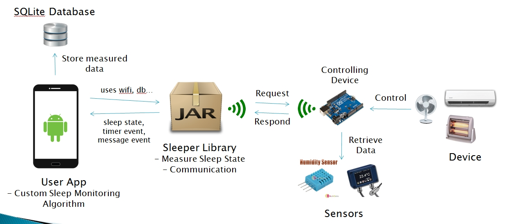

#Sleeper

##Summary
_Sleeper_ is a library that provides sleep state classification interface and communication interface with remote device.
There are so many apps that does sleep state classification but almost none are doing useful job using classified sleep state.
And they are usually spaghetti code, which is hard to only utilize sleep state classification. So we built library _Sleeper_
so that user can easily use sleep state classification. And also provide communication interface to control remote device 
using those classified sleep state.

We used Android Studio 1.3 to make sample project and library so there's no support for Eclipse.**

##System Overview

##Sleep State Classifier
 This classifier is implemented in clDataProcessor. It classifies sleep state every 1 minute and it is not changeable. So you have to
 note this fact to make your app.

##How To Use
 You need to follow steps below to set your android studio project. 'Sample1' is android project file that followed below (1) to (5) steps.
 You need :
  - JTransform-3.0.jar
  - JLargeArrays-1.2.jar
  - sleeperlib.jar
  - armeabi(containing compiled library file)
 
 ####**Android**: [JAVADOC][http://sleeperkky.github.io/Sleeper/]
 
 (1) Download JTransform-3.0.jar from http://mvnrepository.com/artifact/com.github.wendykierp/JTransforms/3.0 and
    download JLargeArrays-1.2.jar from http://mvnrepository.com/artifact/pl.edu.icm/JLargeArrays/1.2. Also download 'sleeperlib.jar' above and
	put it in your project folder's '\app\libs' folder.

 (2) Put 'armeabi' folder in your project folder's '\app\libs' folder like above and put below code in your gradle (Module : app).
	    
		android{
		      ...
            sourceSets.main{
                jni.srcDirs = []
                jniLibs.srcDir 'libs'
            }
		    ...
	    }
		
 (3) Put 'SvmFile' folder in your smart phone sd card, the base directory when you plug your phone into computer.
		
 (4) Add below permission to manifest file of your project.
 
    <uses-permission android:name="android.permission.ACCESS_WIFI_STATE"/>
    <uses-permission android:name="android.permission.ACCESS_NETWORK_STATE"/>
    <uses-permission android:name="android.permission.INTERNET"/>
    <uses-permission android:name="android.permission.READ_EXTERNAL_STORAGE"/>
    <uses-permission android:name="android.permission.WRITE_EXTERNAL_STORAGE"/>
    <uses-permission android:name="android.permission.WAKE_LOCK"/>
	 
 (5) Make class of your own and extend 'clDataProcessor' class from library like below.
     Your dataprocessor has to implement 'clDataProcessor.clSleepStageClassifier.ISleepStateListener'
	 to get sleep state classification result. *Note that classification occurs every 1 minute so 
	 *onSleepStateRetrievedEvent* occurs every 1 minute.
 
    public clMyDataProcessor extends clDataProcessor implements clDataProcessor.clSleepStageClassifier.ISleepStateListener 
	{
	  ...
	  
	   protected MyDataProcessor(Context context) {
        super(context);

        sleepStageClassifier=getSleepStageClassifier() ;//get sleep state classifier from clDataProcessor class

        sleepStageClassifier.registerSleepStateListener(this);//register to sleep state classifier
      }
	  
	  public void onSleepStateRetrievedEvent(int sleepState, Double[] doubles) {
	  
		///Do your stuff using sleepState, which is classified sleep state.
	  }
	}
	 
   And create instance of clApp and your dataprocessor clMyDataProcessor in main activity's onCreate method.
   
    public class MainActivity extends Activity{
	 private clApp myAPP=null ;
	 ...
	    protected void onCreate(Bundle savedInstanceState){
		
			...
		 clDataProcessor dataProcessor=new MyDataProcessor(this) ;
         myApp=new clApp(this,dataProcessor) ;
		}
	 ...
	}
	
 (6) Now, you can use our library. Above steps only covers how to use sleep state classifier. If you don't want to
	 coummunicate with Arduino or other remote device then your job is done. If you want to use arduino with it then
	 you have to follow below steps and see **Arduino** section below. We will update shortly.
	
	
	 
	 
 **Arduino**
 
 - Go to 'SleeperDevice' branch and see 'Note' section.

##Note

 09.20.2015
  - Feature for practising svm and svm classification is changed from PIM(Propotional Integration Mode), intensity values(sqrt(x^2+y^2+z^2) of accelerometer) to FFT(Fast Fourier Transform) coefficients since value of PIM,
    intensity values are so dependent on type of accelerometer in various smart phone. We updated all files above to meet that change.
	
 ### 09.22.2015
  - Removed redundant code in clDatabaseManager in clDataProcessor and in StatisticSelectFragment.
  
 ### 09.23.2015
  - Fixed **clComManager** bug that sharing same socket reference in multiple thread and keep changing reference at each new connection is made.
  
 ### 09.27.2015
  - Fixed error that occurs when measure is stopped. 
  - Erased some redundant code in project java files and added comments to classes in package endclasses.
  - Modified some code in propclasses, endclasses package.
  - Changed System Overview image.
  - Changed apk files to include latest update
  
 ### 10.24.2015
  - Added licenses(still working)
  - Discarded 'Future Direction' section since we are focusing on building good library, not app itself.
  
 ### 10.29.2015
  - Simplifying README.MD to be read more esaily.
  - We made message parsing library for arduino and tested successfully. We will upload it soon.
  
 ### 10.30.2015
  - Still simplifying README.MD to be read more esaily.
	 